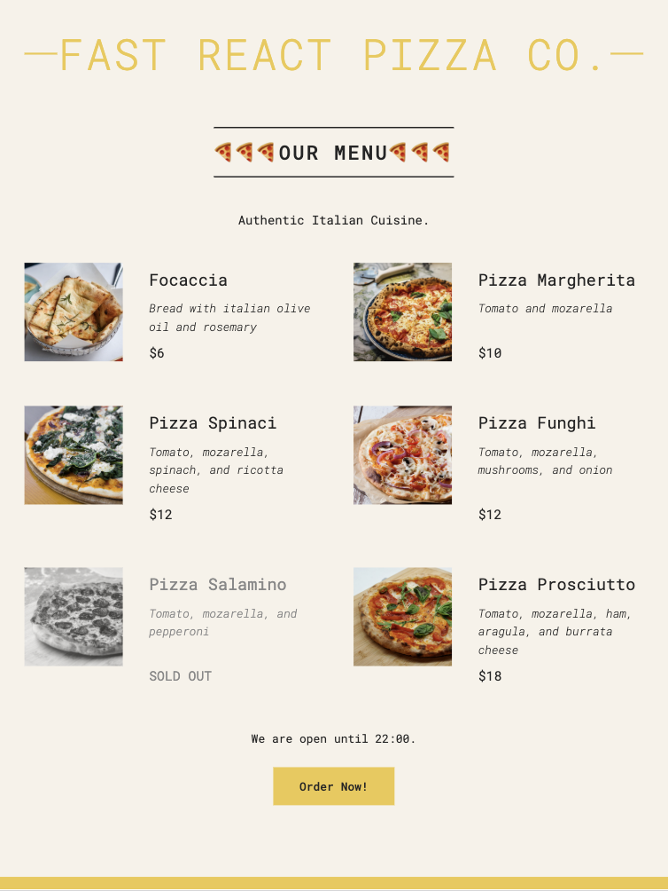

# Pizza Menu

A modern web application for displaying and managing a pizza menu, built with React.

## Demo


## Features

- Interactive pizza menu display
- Modern and responsive user interface
- Built with React 18
- Optimized for performance

## Prerequisites

Before you begin, ensure you have the following installed:
- Node.js (version 14 or higher)
- npm (comes with Node.js)

## Installation

1. Clone the repository:
```bash
git clone [your-repository-url]
cd pizza-menu
```

2. Install dependencies:
```bash
npm install
```

## Development

To start the development server:

```bash
npm start
```

This will run the app in development mode. Open [http://localhost:3000](http://localhost:3000) to view it in your browser.

## Building for Production

To create a production build:

```bash
npm run build
```

This will create an optimized production build in the `build` folder.

## Testing

To run tests:

```bash
npm test
```

## Project Structure

```
pizza-menu/
├── public/          # Static files
├── src/            # Source files
│   ├── components/ # React components
│   ├── assets/     # Images and other assets
│   └── App.js      # Main application component
├── package.json    # Project dependencies and scripts
└── README.md       # Project documentation
```

## Technologies Used

- React 18
- Create React App
- Modern JavaScript (ES6+)
- CSS3

## Contributing

1. Fork the repository
2. Create your feature branch (`git checkout -b feature/AmazingFeature`)
3. Commit your changes (`git commit -m 'Add some AmazingFeature'`)
4. Push to the branch (`git push origin feature/AmazingFeature`)
5. Open a Pull Request

## License

This project is licensed under the MIT License - see the LICENSE file for details.
